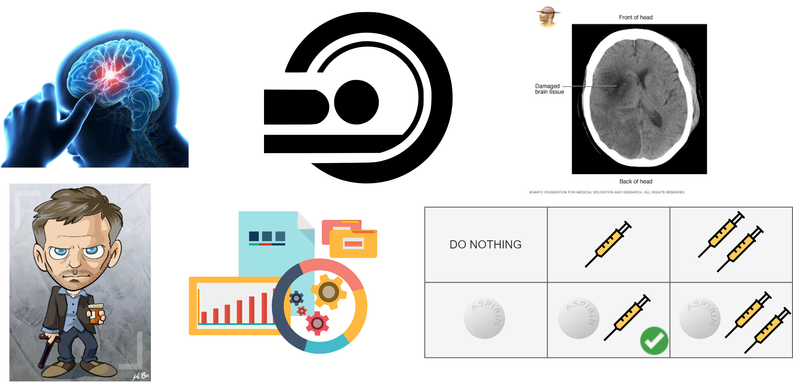
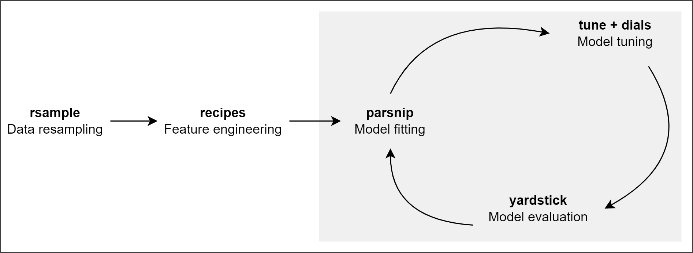

```{r extra-setup, include = FALSE, cache = FALSE}
knitr::opts_chunk$set(cache = TRUE, autodep = TRUE)
xaringanExtra::use_panelset()
xaringanExtra::use_tachyons()
source("code/custom-funs.R")
```

```{r setup, include = FALSE, cache = FALSE}
library(conflicted)
library(rio)
library(mapview)
library(crosstable)
library(plotly)
conflict_prefer("layout", "plotly")
library(reactablefmtr)
library(DALEX)
library(patchwork)
library(boxr)
box_auth()
```

# .purple[The big picture]

```{r big-picture, echo = FALSE, out.width = "85%"}

```

Image sources:
[TL via PNGitem](https://www.pngitem.com/middle/ibhJmTw_risk-carotid-stroke-chiropractic-care-brain-stroke-png/);
[TC via Pinclipart](https://www.pinclipart.com/pindetail/iTwxmbh_ct-scan-clipart-png-download/);
[TR via Mayo Clinic](https://www.mayoclinic.org/diseases-conditions/stroke/multimedia/img-20116031);
[BL via DEVIANT ART](https://www.deviantart.com/kevinbolk/art/House-MD-Art-Card-165347334);
[BC via PikPng](https://www.pikpng.com/pngvi/Tibxom_erp-software-development-in-islamabd-pakistan-data-analysis-clipart-png-transparent-png/);
[BR1 via pngset](https://pngset.com/download-free-png-afvwa), 
[BR2 via CLIPARTMAX](https://www.clipartmax.com/max/m2i8i8N4A0H7H7N4/), 
[BR3 via Wikimedia](https://commons.wikimedia.org/wiki/File:Eo_circle_green_checkmark.svg)

---

layout: false
class: bg-main3 split-30 hide-slide-number

.column[

]
.column.slide-in-right[.content.vmiddle[
.sliderbox.shade_main.pad1[
.font5[Precision medicine 101]
]
]]

---

# .purple[Current scenario in medicine]

```{r current-medicine, echo = FALSE, out.width = "95%"}
knitr::include_graphics("https://www.efpia.eu/media/602899/screenshot-2021-08-03-at-170409.png")
```

[via efpia](https://www.efpia.eu/about-medicines/development-of-medicines/precision-medicine/)

---

# .purple[Future of medicine]

```{r future-medicine, echo = FALSE, out.width = "95%"}
knitr::include_graphics("https://www.efpia.eu/media/602901/screenshot-2021-08-03-at-170328.png")
```

[via efpia](https://www.efpia.eu/about-medicines/development-of-medicines/precision-medicine/)

---

layout: false
class: bg-main3 split-30 hide-slide-number

.column[

]
.column.slide-in-right[.content.vmiddle[
.sliderbox.shade_main.pad1[
.font5[Ischemic stroke 101]
]
]]

---

# .purple[What is ischemic stroke?]

```{r ischemic-stroke-graphic, echo = FALSE, out.width = "90%"}
knitr::include_graphics("https://www.stroke.org.uk/sites/default/files/publications/ischaemic_stroke_graphic_by_the_stroke_association_full_width_content_image.png")
```

[via Stroke Association](https://www.stroke.org.uk/what-is-stroke/types-of-stroke/ischaemic-stroke#:~:text=Around%2085%25%20of%20strokes%20are,vessels%20deep%20inside%20the%20brain.)

---

# .purple[Ischemic stroke types]

.panelset[

.panel[.panel-name[Thrombotic stroke]

```{r gyfcat-thrombotic-stroke, echo = FALSE, out.width = "64%"}
knitr::include_graphics("https://thumbs.gfycat.com/BouncyDapperChamois-size_restricted.gif")
```

[via Gyfcat](https://gfycat.com/bouncydapperchamois)

]

.panel[.panel-name[Embolic stroke]

```{r gyfcat-embolic-stroke, echo = FALSE, out.width = "54%"}
knitr::include_graphics("https://thumbs.gfycat.com/InbornFrigidIcterinewarbler-size_restricted.gif")
```

[via Gyfcat](https://gfycat.com/inbornfrigidicterinewarbler)

]
]

---

# .purple[Ischemic stroke treatments]

.pull-left[

## Aspirin

```{r wiki-aspirin, echo = FALSE}
knitr::include_graphics("https://upload.wikimedia.org/wikipedia/commons/2/28/Aspirin1.jpg")
```

[via Wikimedia Commons](https://commons.wikimedia.org/wiki/File:Aspirin1.jpg)

]

.pull-right[

## Heparin

```{r wiki-heparin, echo = FALSE, out.width = "65%"}
knitr::include_graphics("https://upload.wikimedia.org/wikipedia/commons/d/d0/Heparin_Sodium_sample.jpg")
```

[via Wikimedia Commons](https://commons.wikimedia.org/wiki/File:Heparin_Sodium_sample.jpg)

]

---

layout: false
class: bg-main3 split-30 hide-slide-number

.column[

]
.column.slide-in-right[.content.vmiddle[
.sliderbox.shade_main.pad1[
.font5[International Stroke Trial]
]
]]

---

# .purple[International Stroke Trial (IST) at a glance]

.pull-left[

### Treatment scheme: Aspirin x Heparin

```{r ist-treatment-scheme, echo = FALSE}
knitr::include_graphics("figs/ist-treatment-scheme.png")
```

[via Clipart](http://clipart-library.com/newhp/119-1195221_file-care-cartoon-svg-wikimedia-commons-open-patient.png)

]

.pull-right[

### Outcome: Dead or dependent at 6-months

```{r ist-outcome, echo = FALSE, fig.show = "hold", out.width = "49%"}
knitr::include_graphics(
  c(
    "http://clipart-library.com/img/1371179.jpg",
    "http://clipart-library.com/newhp/walker-caregiver.jpg"
  )
)
```

[via Clipart](http://clipart-library.com/)

]

---

# .purple[IST recruitment: 19,435 patients, 467 hospitals, 36 countries]

```{r patient-map-leaflet, echo = FALSE, message = FALSE, out.width = "100%"}
patient_map_leaflet <- box_read(943115285417) %>%
  fix_html_dependency()
patient_map_leaflet
```

---

# .purple[IST high-level data summary]

.panelset[

.panel[.panel-name[Treatment crosstab]

```{r ist-trt-crosstab, echo = FALSE, message = FALSE}
ist_trt_crosstab <- box_read(943111724495)
ist_trt_crosstab
```

]

.panel[.panel-name[Treatment by outcome crosstab]

```{r ist-trt-by-outcome-crosstab, echo = FALSE, message = FALSE}
ist_trt_by_outcome_crosstab <- box_read(943125043668)
ist_trt_by_outcome_crosstab
```

]
]

---

layout: false
class: bg-main3 split-30 hide-slide-number

.column[

]
.column.slide-in-right[.content.vmiddle[
.sliderbox.shade_main.pad1[
.font5[Exploratory data analysis]
]
]]

---

# [Preliminary EDA](https://public.tableau.com/app/profile/ashirwad.barnwal5453/viz/ist-corrected-eda/ISTEDA)

<iframe src="https://public.tableau.com/views/ist-corrected-eda/ISTEDA?:language=en-US&:display_count=n&:origin=viz_share_link?:showVizHome=no&:embed=true" width="1100" height="475"></iframe>

---

# [Detailed EDA](https://ashirwad.github.io/stat599-creative-component/detailed-eda.html)

```{r detailed-eda-report, echo = FALSE}
knitr::include_url(
  "https://ashirwad.github.io/stat599-creative-component/detailed-eda.html",
  height = "475px"
)
```

---

layout: false
class: bg-main3 split-30 hide-slide-number

.column[

]
.column.slide-in-right[.content.vmiddle[
.sliderbox.shade_main.pad1[
.font5[Machine learning in R]
]
]]

---

# .purple[Meet tidymodels]

.panelset[

.panel[.panel-name[Core packages]

```{r tidymodels-packages, echo = FALSE, fig.show = "hold", out.width = "45%"}
knitr::include_graphics(
  c(
    "https://jhudatascience.org/tidyversecourse/images/book_figures/simpletidymodels.png",
    "https://jhudatascience.org/tidyversecourse/images/book_figures/Updated_tidymodels_basics.png"
  )
)
```

[via Tidyverse course](https://jhudatascience.org/tidyversecourse/model.html#packages-of-tidymodels)

]

.panel[.panel-name[Machine learning workflow]

```{r tidy-ml-workflow, echo = FALSE}

```

]
]

---

# .purple[Machine learning algorithms]

.panelset[

.panel[.panel-name[Random forest]

```{r random-forest, echo = FALSE, out.width = "45%"}
knitr::include_graphics("https://www.tibco.com/sites/tibco/files/media_entity/2021-05/random-forest-diagram.svg")
```

[via TIBCO](https://www.tibco.com/reference-center/what-is-a-random-forest)

]

.panel[.panel-name[Neural network]

```{r neural-network, echo = FALSE, out.width = "80%"}
knitr::include_graphics("https://www.simplilearn.com/ice9/free_resources_article_thumb/ArtificalNeuralNetwork.PNG")
```

[via simplilearn](https://www.simplilearn.com/tutorials/deep-learning-tutorial/deep-learning-algorithm)

]

.panel[.panel-name[Support vector machine]

```{r support-vector-machine, echo = FALSE, fig.show = "hold", out.width = "40%"}
knitr::include_graphics(
  c(
    "https://learnopencv.com/wp-content/uploads/2018/07/support-vectors-and-maximum-margin-768x683.png",
    "https://learnopencv.com/wp-content/uploads/2018/01/opcv4face-w7-m1-nonLinearSVM.png"
  )
)
```

[via LearnOpenCV](https://learnopencv.com/support-vector-machines-svm/)

]
]

---

# .purple[Algorithm comparison]

```{r algo-comp-table, echo = FALSE, message = FALSE}
algo_comp_table <- box_read(944769892475)
algo_comp_table
```

---

# .purple[ROC-AUC curves]

```{r roc-curves, echo = FALSE, message = FALSE, out.width = "80%"}
roc_curves <- box_read(944290874393)
roc_curves
```

---

# .purple[Residual diagnostics]

```{r resid-diag-plot, include = FALSE}
resid_diag_plot <- box_read(944789963509)
resid_diag_plot
```

.pull-left[

```{r resid-diag-box, echo = FALSE}
resid_diag_plot[[1]]
```

]

.pull-right[

```{r resid-diag-line, echo = FALSE}
resid_diag_plot[[2]]
```

]

---

layout: false
class: bg-main3 split-30 hide-slide-number

.column[

]
.column.slide-in-right[.content.vmiddle[
.sliderbox.shade_main.pad1[
.font5[Model interpretation]
]
]]

---

# .purple[Variable importance plot]

```{r vip-plot, echo = FALSE, message = FALSE, out.width = "100%"}
vip_plot <- box_read(944362375155)
vip_plot
```

---

# .purple[Global interpretation]

```{r pdp-age-rsbp, echo = FALSE, message = FALSE, out.width = "100%"}
pdp_age_rsbp <- box_read(944402718981)
pdp_age_rsbp
```

---

# .purple[Local interpretation]

```{r local-profile-old, echo = FALSE, message = FALSE, out.width = "100%"}
local_profile_old <- box_read(944753607091)
local_profile_old
```

---

# .purple[Thanks & Happy Spring!]

```{r happy-spring, echo = FALSE, out.width = "64%"}
knitr::include_graphics("figs/isu-campanile-spring.jpg")
```

[via Iowa State University](https://iowastate.photoshelter.com/galleries/C0000rWLI9E_oKgc/G0000J2URC8AfrrQ/I0000yOytd2IQ8b8/20200406-CycloneVision047-JPG)

