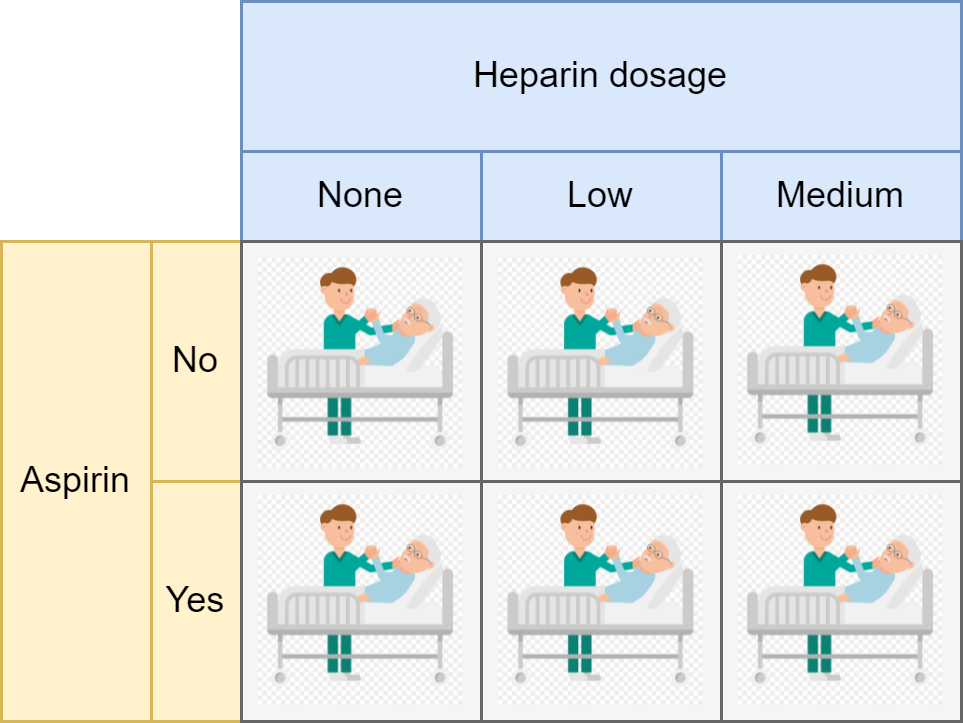

```{r extra-setup, include = FALSE}
xaringanExtra::use_panelset()
xaringanExtra::use_tachyons()
source("code/custom-funs.R")
```

```{r setup, include = FALSE}
library(conflicted)
library(rio)
library(mapview)
library(crosstable)
library(boxr)
box_auth()
```

---

layout: false
class: bg-main3 split-30 hide-slide-number

.column[

]
.column.slide-in-right[.content.vmiddle[
.sliderbox.shade_main.pad1[
.font5[Precision medicine 101]
]
]]

---

# .purple[Current scenario in medicine]

```{r current-medicine, echo = FALSE, out.width = "95%"}
knitr::include_graphics("https://www.efpia.eu/media/602899/screenshot-2021-08-03-at-170409.png")
```

[via efpia](https://www.efpia.eu/about-medicines/development-of-medicines/precision-medicine/)

---

# .purple[Future of medicine]

```{r future-medicine, echo = FALSE, out.width = "95%"}
knitr::include_graphics("https://www.efpia.eu/media/602901/screenshot-2021-08-03-at-170328.png")
```

[via efpia](https://www.efpia.eu/about-medicines/development-of-medicines/precision-medicine/)

---

layout: false
class: bg-main3 split-30 hide-slide-number

.column[

]
.column.slide-in-right[.content.vmiddle[
.sliderbox.shade_main.pad1[
.font5[Ischemic stroke 101]
]
]]

---

# .purple[What is ischemic stroke?]

```{r ischemic-stroke-graphic, echo = FALSE, out.width = "90%"}
knitr::include_graphics("https://www.stroke.org.uk/sites/default/files/publications/ischaemic_stroke_graphic_by_the_stroke_association_full_width_content_image.png")
```

[via Stroke Association](https://www.stroke.org.uk/what-is-stroke/types-of-stroke/ischaemic-stroke#:~:text=Around%2085%25%20of%20strokes%20are,vessels%20deep%20inside%20the%20brain.)

---

# .purple[Ischemic stroke types]

.panelset[

.panel[.panel-name[Thrombotic stroke]

```{r gyfcat-thrombotic-stroke, echo = FALSE, out.width = "64%"}
knitr::include_graphics("https://thumbs.gfycat.com/BouncyDapperChamois-size_restricted.gif")
```

[via Gyfcat](https://gfycat.com/bouncydapperchamois)

]

.panel[.panel-name[Embolic stroke]

```{r gyfcat-embolic-stroke, echo = FALSE, out.width = "54%"}
knitr::include_graphics("https://thumbs.gfycat.com/InbornFrigidIcterinewarbler-size_restricted.gif")
```

[via Gyfcat](https://gfycat.com/inbornfrigidicterinewarbler)

]
]

---

# .purple[Ischemic stroke treatments]

.pull-left[

## Aspirin

```{r wiki-aspirin, echo = FALSE}
knitr::include_graphics("https://upload.wikimedia.org/wikipedia/commons/2/28/Aspirin1.jpg")
```

[via Wikimedia Commons](https://commons.wikimedia.org/wiki/File:Aspirin1.jpg)

]

.pull-right[

## Heparin

```{r wiki-heparin, echo = FALSE, out.width = "65%"}
knitr::include_graphics("https://upload.wikimedia.org/wikipedia/commons/d/d0/Heparin_Sodium_sample.jpg")
```

[via Wikimedia Commons](https://commons.wikimedia.org/wiki/File:Heparin_Sodium_sample.jpg)

]

---

layout: false
class: bg-main3 split-30 hide-slide-number

.column[

]
.column.slide-in-right[.content.vmiddle[
.sliderbox.shade_main.pad1[
.font5[International Stroke Trial]
]
]]

---

# .purple[International Stroke Trial (IST) at a glance]

.pull-left[

### Treatment scheme: Aspirin x Heparin

```{r ist-treatment-scheme, echo = FALSE}

```

[via Clipart](http://clipart-library.com/newhp/119-1195221_file-care-cartoon-svg-wikimedia-commons-open-patient.png)

]

.pull-right[

### Outcome: Dead or dependent at 6-months

```{r ist-outcome, echo = FALSE, fig.show = "hold", out.width = "49%"}
knitr::include_graphics(
  c(
    "http://clipart-library.com/img/1371179.jpg",
    "http://clipart-library.com/newhp/walker-caregiver.jpg"
  )
)
```

[via Clipart](http://clipart-library.com/)

]

---

# .purple[IST recruitment: 19,435 patients, 467 hospitals, 36 countries]

```{r patient-map-leaflet, echo = FALSE, message = FALSE, out.width = "100%"}
patient_map_leaflet <- box_read(943115285417) %>%
  fix_html_dependency()
patient_map_leaflet
```

---

# .purple[IST high-level data summary]

.panelset[

.panel[.panel-name[Treatment crosstab]

```{r ist-trt-crosstab, echo = FALSE, message = FALSE}
ist_trt_crosstab <- box_read(943111724495)
ist_trt_crosstab
```

]

.panel[.panel-name[Treatment by outcome crosstab]

```{r ist-trt-by-outcome-crosstab, echo = FALSE, message = FALSE}
ist_trt_by_outcome_crosstab <- box_read(943125043668)
ist_trt_by_outcome_crosstab
```

]
]

---

layout: false
class: bg-main3 split-30 hide-slide-number

.column[

]
.column.slide-in-right[.content.vmiddle[
.sliderbox.shade_main.pad1[
.font5[Exploratory data analysis]
]
]]

---

# [Tableau story](https://public.tableau.com/app/profile/ashirwad.barnwal5453/viz/ist-corrected-eda/ISTEDA)

<iframe src="https://public.tableau.com/views/ist-corrected-eda/ISTEDA?:language=en-US&:display_count=n&:origin=viz_share_link?:showVizHome=no&:embed=true" width="1100" height="475"></iframe>
